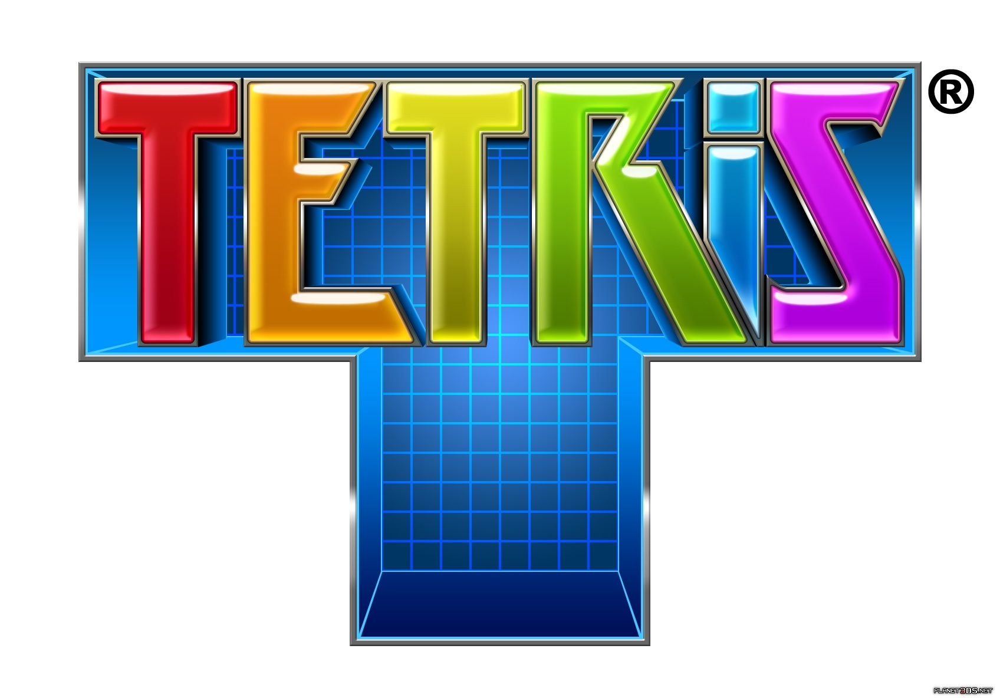
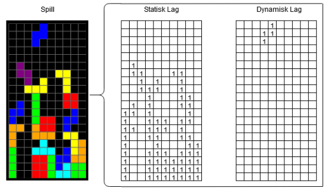

# Tetris using Learning from Demonstrations 
<p align="center">
  
</p>

This porject presents the classic game of <a href="https://es.wikipedia.org/wiki/Tetris" target="_blank">Tetris</a> built using <a href="https://www.pygame.org/news" target="_blank">PyGame</a> whcich makes use of anm agente to learn trough human data how to play this mytical game.

# Usage 

`main.py` for playing Tetris manually.

`main_imitation.py` for training and data collection Imitation learning.

The different modes of use can be applied by modifying the following functions:

```py
if __name__ == "__main__":
    train() # Trains and validate the model using data acquired playing
    model.save_weights() # Save the model weigths
    model.load_weights('_10k_01_nat1') # Load the model weigths
    main() # Shows a model trained or allow the user to play and generate new data
    generate_data(400) #Generates sinthetic data using a natural selection algorithm

```
If the process you wanna do is take data, you must select in `main_imitation.py`.

```py
def main(manual=1): # Manual=1(user data acquisition)
```

## Environment
To edit Tetris behaviour change contructor params.

```py
env = Tetris({
  'reduced_shapes': True,
  'reduced_grid': True
})
```
Where `reduced_shapes` control the type of pieces used in the learning process and `reduced_grid` control de type of grid.

Enviorment follows regular OpenAI standard.
```py
from enviorment.tetris import Tetris

from Imitation.agent import imitation_agent
from nat_selection.model import Model
from dqn.agent import DQN

env = Tetris() 

# Agent can either be custom.
 agent = imitation_agent(env)


total_score = 0
state, reward, done, info = env.reset()

while not done:

  # for random action
  action = env.action_sample 
  
  # for agent action
  # Be aware that different agents have different methods of getting the next action.
  action = agent.policy(state)
  
  state, reward, done, info = env.step(action)
  total_score += reward
  
  env.render()
```

State is a three dimensional array with 2 layers representing the placed blocks and the ones you are controlling. Blocks are 1 and blank cells are 0.

<p align="center">

</p>

Loading pretrained models can be done like this.
```py
from enviorment.tetris import Tetris

from Imitation.agent import imitation_agent
from nat_selection.model import Model
from dqn.agent import DQN

env = Tetris() 

# Imitation
agent = imitation_agent(env)
agent.load_weights('_10k_01_nat1')
# Where the argument is the suffix after "weights" in ./Imitation/weights

```

# Install
For installation, enter the directory

> cd TetrisLfd/ 

and install al the dependencies:
> pip install -r requirements.txt 

and <a href="https://pytorch.org/" target="_blank">Pytorch</a>

